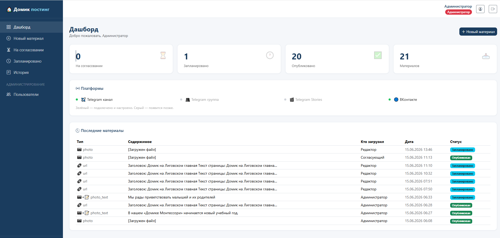
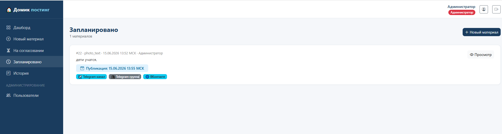
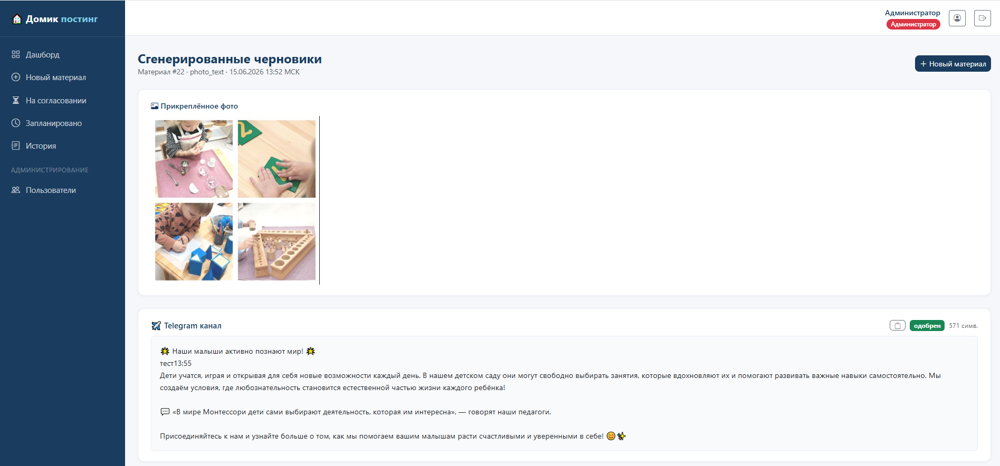

# Домик Постинг

Панель автоматической публикации в социальные сети для детского сада «Монтессори Центр "Домик на Лиговском"».

Редакторы загружают материал (текст, ссылку, фото, видео, аудио), система через GigaChat генерирует адаптированные посты для каждой платформы, согласующий проверяет и одобряет публикацию.

## Возможности

- **Генерация постов** — GigaChat автоматически адаптирует один материал под Telegram, ВКонтакте и другие платформы
- **Ролевая модель** — три роли: `editor` (создаёт материалы), `approver` (согласует), `admin` (управление пользователями)
- **Редактирование черновиков** — редакторы и согласующие могут вносить правки перед публикацией
- **Отложенная публикация** — выбор времени публикации, автоматический постинг по расписанию
- **Медиафайлы** — поддержка фото, видео, аудио (с распознаванием речи), PDF
- **История** — полный журнал публикаций с результатом по каждой платформе
- **Безопасность** — HTTPS-only куки, закрытый OpenAPI, IDOR-защита, rate limiting на логин

## Скриншоты

### Дашборд
Статистика публикаций, подключённые платформы и журнал последних материалов.



### Запланированные публикации
Материалы с датой и временем публикации по московскому времени, статусы по каждой платформе.



### Сгенерированные черновики
GigaChat адаптирует загруженный материал под каждую платформу — черновики доступны для редактирования перед публикацией.



## Стек технологий

| Компонент | Технология |
|---|---|
| Backend | FastAPI (Python 3.11+) |
| Шаблоны | Jinja2 + Bootstrap 5.3 |
| База данных | PostgreSQL 16 (production) / SQLite (разработка) |
| ORM | SQLAlchemy |
| Планировщик | APScheduler |
| ИИ | GigaChat API (Sberbank) |
| Веб-сервер | Nginx + Uvicorn |
| Деплой | Docker Compose |
| SSL | Let's Encrypt / Certbot |

## Поддерживаемые платформы

| Платформа | Статус |
|---|---|
| Telegram канал | ✅ Работает |
| Telegram группа | ✅ Работает |
| ВКонтакте | ✅ Работает |
| Одноклассники | 🔜 Планируется |
| Яндекс Карты | 🔜 Планируется |
| Яндекс Дзен | 🔜 Планируется |
| Instagram | 🔜 Планируется |
| Telegram Stories | 🔜 Планируется |

## Быстрый старт (локально)

```bash
git clone https://github.com/YOUR_USERNAME/domik-posting.git
cd domik-posting

# Создать окружение
python -m venv venv
source venv/bin/activate  # Windows: venv\Scripts\activate
pip install -r requirements.txt

# Настроить переменные окружения
cp .env.example .env
# Отредактировать .env — заполнить токены и ключи

# Инициализировать базу данных
python scripts/init_db.py

# Запустить
uvicorn app.main:app --reload
```

Панель доступна на http://localhost:8000

## Развёртывание на сервере

Требования: сервер с Ubuntu 22.04+, Docker, Docker Compose, домен с настроенным DNS.

```bash
# Клонировать на сервер
git clone https://github.com/YOUR_USERNAME/domik-posting.git /opt/domik-posting
cd /opt/domik-posting

# Создать .env из шаблона и заполнить
cp .env.example .env
nano .env

# Создать директории
mkdir -p uploads static

# Запустить
docker compose up -d
```

Подробная инструкция по переводу с тестовых каналов на продуктивные: [`docs/production-switch.md`](docs/production-switch.md)

## Переменные окружения

Все настройки задаются в файле `.env`. Шаблон: `.env.example`

| Переменная | Описание |
|---|---|
| `SECRET_KEY` | Секретный ключ сессий (минимум 32 символа) |
| `DATABASE_URL` | URL базы данных |
| `TELEGRAM_BOT_TOKEN` | Токен Telegram-бота |
| `TELEGRAM_CHANNEL_ID` | ID Telegram-канала (вида `-100xxxxxxxxxx`) |
| `TELEGRAM_GROUP_ID` | ID Telegram-группы |
| `VK_COMMUNITY_TOKEN` | Токен сообщества ВКонтакте |
| `VK_GROUP_ID` | ID сообщества ВКонтакте |
| `GIGACHAT_CLIENT_ID` | Client ID для GigaChat API |
| `GIGACHAT_CLIENT_SECRET` | Client Secret для GigaChat API |

## Структура проекта

```
domik-posting/
├── app/
│   ├── routers/          # FastAPI маршруты (auth, content, dashboard, admin)
│   ├── services/
│   │   ├── publishers/   # Публикаторы для каждой платформы
│   │   ├── gigachat.py   # Клиент GigaChat API
│   │   └── prompts.py    # Промпты для генерации постов
│   ├── templates/        # Jinja2 HTML-шаблоны
│   ├── models.py         # SQLAlchemy модели
│   ├── scheduler.py      # Автопостинг по расписанию
│   └── main.py           # Точка входа FastAPI
├── nginx/                # Конфигурация Nginx
├── scripts/              # Утилиты (init_db, redeploy)
├── docs/                 # Документация
├── docker-compose.yml
├── Dockerfile
└── .env.example
```

## Добавление новой платформы

1. Создать файл `app/services/publishers/your_platform.py`, унаследовав `BasePublisher`
2. Реализовать методы `is_configured()` и `publish()`
3. Зарегистрировать в `app/services/publishers/registry.py`
4. Добавить переменные окружения в `.env.example`
5. Написать промпт в `app/services/prompts.py`

## Лицензия

Частный проект. Все права защищены.
